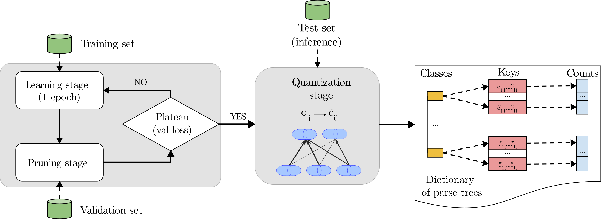

# **Capsule Networks Do Not Need to Model Everything**

**Abstract**: Capsule networks are biologically-inspired neural network models that group neurons into vectors called capsules. Each capsule is an explicit representation of either an object or its parts. A key feature of capsule networks is the routing mechanism, which breaks down complex objects into simpler parts organized in a hierarchical structure known as a parse tree.
However, one drawback of capsule networks is that they like to model all elements in an image to achieve high generalization. Consequently, these networks should have large sizes to model image complexities such as intricate backgrounds. In this paper, we remove the need for the networks to account for everything in the input, allowing them to focus only on the object of interest or its more discriminative parts, reducing their number of parameters.
We accomplish this with REM, a technique that minimizes the entropy of the parse tree-like structure. REM drives the model parameters distribution towards low entropy configurations, using a pruning mechanism as a proxy. 
Thanks to REM, we observe a substantial reduction in the generation of intra-class parse trees. This reduction indicates that capsules can now learn more discriminative features with reasonable sized nets. We show that capsules can achieve similar generalization ability even when not accounting for the clutter, having more stable relationships between them.

<div style="text-align: center">

</div>

## Getting Started

### Setup virtualenv

```
pip install virtualenv
virtualenv rem
source rem/bin/activate
pip install -r requirements.txt
```

### Setup Weights & Biases
This repository uses Weight & Biases for experiment tracking. Set your account's project and entity names in the `src/wandb_project.json` file.

To create a Weight & Biases account see [(creating a weights and biases account)](https://app.wandb.ai/login?signup=true) and the associated [quickstart guide](https://docs.wandb.com/quickstart).

### Download affNIST test set dataset
```
mkdir -p data/raw/affNIST
wget https://www.cs.toronto.edu/~tijmen/affNIST/32x/transformed/test.mat.zip -P data/raw/affNIST
unzip data/raw/affNIST/test.mat.zip -d data/raw/affNIST/
```

## Results

```
cd src/
```

### Training CapsNet (with and without pruning) one seed on MNIST

```
python main.py --config configs/mnist_pruning_oneseed.json --output configs/wandb_runs_mnist_oneseed.json
python main.py --config configs/mnist_nopruning_oneseed.json --output configs/wandb_runs_mnist_oneseed.json
```

More arguments such as gpu index can be found in the corresponding config json files.

### Training gamma-CapsNet (with and without pruning) one seed on MNIST

```
python main.py --config configs/gamma_mnist_pruning_oneseed.json --output configs/wandb_runs_gamma_mnist_oneseed.json
python main.py --config configs/gamma_mnist_nopruning_oneseed.json --output configs/wandb_runs_gamma_mnist_oneseed.json
```

### Training DeepCaps (with and without pruning) one seed on MNIST

```
python main.py --config configs/deepcaps_mnist_pruning_oneseed.json --output configs/wandb_runs_deepcaps_mnist_oneseed.json
python main.py --config configs/deepcaps_mnist_nopruning_oneseed.json --output configs/wandb_runs_deepcaps_mnist_oneseed.json
```

### Results of CapsNet+Q and CapsNet+REM one seed on MNIST

```
python inference.py --dataset mnist --wandb_runs configs/wandb_runs_mnist_oneseed.json --split test --binning
```

### Results of gamma-CapsNet+Q and gamma-CapsNet+REM one seed on MNIST

```
python inference.py --dataset mnist --wandb_runs configs/wandb_runs_gamma_mnist_oneseed.json --split test --binning
```

### Results of DeepCaps+Q and DeepCaps+REM one seed on MNIST

```
python inference.py --dataset mnist --wandb_runs configs/wandb_runs_deepcaps_mnist_oneseed.json --split test --binning
```

### Results for first and best epoch for CapsNet+Q, last epoch for CapsNet+REM
```
python save_distributions.py --wandb_runs configs/wandb_runs_mnist_oneseed.json --dataset mnist --split test --epoch first --no-pruning
python save_distributions.py --wandb_runs configs/wandb_runs_mnist_oneseed.json --dataset mnist --split test --epoch best --no-pruning
python save_distributions.py --wandb_runs configs/wandb_runs_mnist_oneseed.json --dataset mnist --split test --epoch last --pruning

python plot_distributions.py
```

### Entropy vs Pruned param plot
```
python entropies.py --dataset mnist --split test --binning --wandb_run configs/wandb_runs_mnist_oneseed.json
python entropies.py --entropy_path ../dump/entropies.npy
```

### Training CapsNet on MNIST (all seeds)

```
python main.py --config configs/mnist_pruning.json --output configs/wandb_runs.json
python main.py --config configs/mnist_nopruning.json --output configs/wandb_runs.json
```

### Training CapsNet on other datasets

Training on Fashion-MNIST, CIFAR10, affNIST and Tiny-ImageNet is also supported.

```
python main.py --config configs/fashionmnist_pruning.json --output configs/wandb_runs.json
python main.py --config configs/fashionmnist_nopruning.json --output configs/wandb_runs.json
python main.py --config configs/cifar10_pruning.json --output configs/wandb_runs.json
python main.py --config configs/cifar10_nopruning.json --output configs/wandb_runs.json
python main.py --config configs/affNIST_pruning.json --output configs/wandb_runs.json
python main.py --config configs/affNIST_nopruning.json --output configs/wandb_runs.json
python main.py --config configs/tiny-imagenet_pruning.json --output configs/wandb_runs.json
python main.py --config configs/tiny-imagenet_nopruning.json --output configs/wandb_runs.json
```

### Results of CapsNet, CapsNet+Q and CapsNet+REM on MNIST (all seeds)
```
python inference.py --dataset mnist --wandb_runs configs/wandb_runs.json  --split test --no-binning
python inference.py --dataset mnist --wandb_runs configs/wandb_runs.json  --split test --binning
```

### Results of CapsNet+Q and CapsNet+REM on Fashion-MNIST, CIFAR10 and Tiny ImageNet (all seeds)

```
python inference.py --dataset fashion-mnist --wandb_runs configs/wandb_runs.json --split test --binning
python inference.py --dataset cifar10 --wandb_runs configs/wandb_runs.json --split test --binning
python inference.py --dataset tiny-imagenet-200 --wandb_runs configs/wandb_runs.json --split test --binning
```

### Results of CapsNet+Q and CapsNet+REM on affNIST

```
python inference.py --dataset affNIST --wandb_runs configs/wandb_runs.json --split test --binning
```

### Visualization of parse trees effects (Supp.)
First, generate the dictionary .pkl with

```
python inference.py --dataset mnist --wandb_runs configs/wandb_runs_mnist_oneseed.json --split test --binning --output_dictionary ../dump
```

The output path of the dictionary will be in this example `../dump/mnist_dict_cij_pruning_nodecoder_test.pkl`

Use the checkpoint at the last epoch of the pruned model and use that path for `--checkpoint` arg.
Use the config file with which you trained the model for `--config` arg.

```
python dictionary.py --config <path-to-config> --checkpoint <path-to-checkpoint>  --dictionary ../dump/mnist_dict_cij_pruning_nodecoder_test.pkl --dataset mnist --split test --output_folder ../dictionary
```
In `../dictionary/mnist/test` you will find the images grouped by the key name. 
Now to overlap such images run

```
python overlaps_dictionary.py --input_folder ../dictionary/mnist/test
```

## Limitations

### Training CapsNets with the decoder (MNIST, Fashion-MNIST, CIFAR10)
```
python main.py --config configs/mnist_pruning_decoder.json --output configs/wandb_runs_decoder.json
python main.py --config configs/mnist_nopruning_decoder.json --output configs/wandb_runs_decoder.json
python main.py --config configs/fashionmnist_pruning_decoder.json --output configs/wandb_runs_decoder.json
python main.py --config configs/fashionmnist_nopruning_decoder.json --output configs/wandb_runs_decoder.json
python main.py --config configs/cifar10_pruning_decoder.json --output configs/wandb_runs_decoder.json
python main.py --config configs/cifar10_nopruning_decoder.json --output configs/wandb_runs_decoder.json
```

### Results of CapsNet+Q and CapsNet+REM with the decoder (MNIST, Fashion-MNIST, CIFAR10)
```
python inference.py --dataset mnist --wandb_runs configs/wandb_runs_decoder.json  --split test --binning
python inference.py --dataset fashion-mnist --wandb_runs configs/wandb_runs_decoder.json  --split test --binning
python inference.py --dataset cifar10 --wandb_runs configs/wandb_runs_decoder.json  --split test --binning
```

### Finetune a CapsNet (trained without decoder, freezed) with the decoder

```
python resume_mnist_decoder.py --config configs/resume_mnist_nopruning_decoder.json --checkpoint <path-to-checkpoint>
```

### Visualize MNIST reconstructions and perturbations of a CapsNet

```
python visualize.py --config <path-to-config> --checkpoint <path-to-checkpoint>
```
